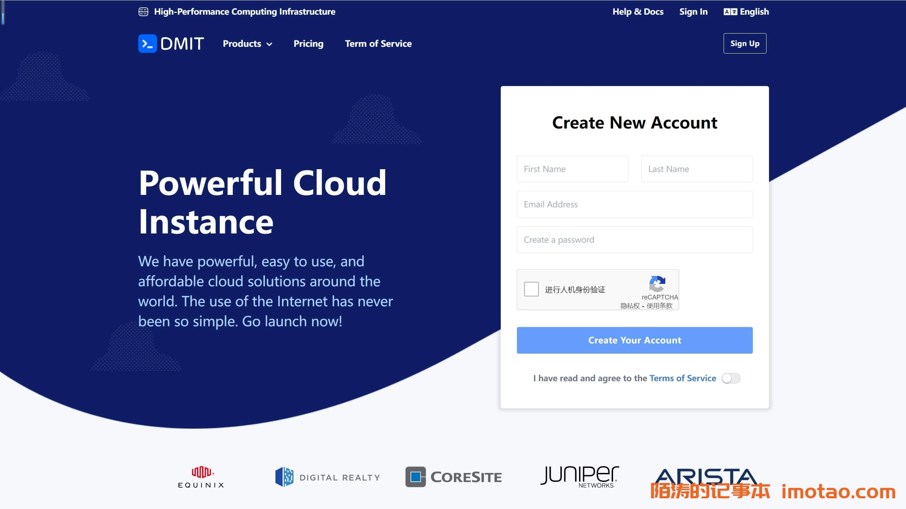

# DMIT Hong Kong VPS: Budget-Friendly High-Bandwidth Solutions Starting at $3/Month

---

Looking for an unregistered Hong Kong VPS with massive bandwidth that won't break the bank? DMIT's latest Hong Kong lineup delivers exactly that. Whether you need RETN Europe-optimized routing, direct connections, or premium CN2 GIA routes, their KVM-based plans offer 10Gbps bandwidth starting from just $36.9/year. Perfect for users seeking Hong Kong VPS hosting without the hassle of domain registration requirements.

---

## What's New with DMIT Hong Kong VPS

DMIT recently restocked their entire Hong Kong VPS inventory across three distinct tiers. Founded in 2017, this US-based provider has built a solid reputation for high uptime and quality routing—particularly their Los Angeles CN2 GIA connections. Now their Hong Kong datacenter brings the same reliability with multiple routing options.

The three available packages cater to different needs:

**Tier 1 (PVM.HKG.T1)** uses RETN Hong Kong-Europe routing optimization. While mainland China users might find the routes less direct, the trade-offs are compelling: rock-bottom pricing, enormous bandwidth allocations, and generous traffic allowances. This tier shines for businesses with international audiences beyond mainland China.

**Eyeball (PVM.HKG.EB)** offers a middle ground with China Mobile bidirectional direct connections, plus China Unicom and Telecom return routing. Outbound traffic routes through NTT.

**Premium (PVM.HKG.Pro)** delivers the gold standard: China Telecom bidirectional CN2 GIA, China Unicom AS10099+AS4837, and China Mobile backbone direct connections. AMD EPYC processors power the host machines.

## Tier 1 Series: Maximum Bang for Your Buck

The PVM.HKG.T1 series runs on KVM virtualization with a default 10Gbps bandwidth allocation—that's not a typo. International optimization routing keeps costs low while maintaining solid performance for global traffic.

**Test IP:** 103.135.248.120

The base configuration starts with 1 CPU core and 0.5GB RAM. Sure, the mainland China routes aren't optimal, but when you're paying $36.9 annually and getting 10Gbps pipes, it's hard to complain. Think of it as the budget warrior of Hong Kong VPS options.

## Eyeball Series: Balanced Performance

The PVM.HKG.EB line splits the difference between economy and premium. You get direct connections where they matter most:

- China Mobile: bidirectional direct
- China Unicom & Telecom: return path direct
- Outbound: routed via NTT

This configuration works well for mixed traffic patterns—domestic Chinese users get decent speeds on return paths, while outbound international traffic stays stable.

## Premium Series: No Compromises

👉 [Looking for bulletproof mainland China connectivity with Hong Kong flexibility? Check out DMIT's Premium tier here](https://www.dmit.io/aff.php?aff=13832)

The PVM.HKG.Pro series doesn't mess around. Each VPS comes with:

- AMD EPYC processors (latest generation)
- China Telecom: full bidirectional CN2 GIA
- China Unicom: AS10099 + AS4837 routing
- China Mobile: backbone direct connections
- 1 IPv4 + 1 IPv6 included

**Test IP:** 103.117.100.20

This tier targets users who need mainland China performance without sacrificing Hong Kong's registration-free advantages. The triple-carrier optimization means your traffic takes the fastest path regardless of which ISP your visitors use.

When you're running business-critical applications or serving mainland audiences, the Premium routing translates directly to better user experience. Page loads feel snappier, API calls complete faster, and video streaming buffers less.

## Payment & Network Testing

DMIT accepts all major payment methods: credit cards, PayPal, WeChat Pay, Alipay, and bank transfers. No friction getting started.

**Network Test IPs:**
- Los Angeles CN2 GIA: 154.17.2.14
- San Jose: 174.136.205.51
- Lite Series: 103.135.248.120
- Japan Standard: 154.31.112.1
- LAX sPro Creator: 45.88.194.49

Run some traceroutes before committing if you want to verify routing for your specific use case.

---

## Bottom Line

DMIT's Hong Kong VPS refresh puts serious bandwidth and routing options within reach of modest budgets. The Tier 1 series works great for international projects at $3/month equivalent pricing. Eyeball hits a sweet spot for mixed traffic. And Premium delivers when mainland China performance is non-negotiable.

The combination of KVM virtualization, 10Gbps bandwidth, and flexible routing makes these plans competitive whether you're hosting APIs, running gaming servers, or building CDN edge nodes. Plus, 👉 [Hong Kong's registration-free hosting environment with DMIT's infrastructure reliability](https://www.dmit.io/aff.php?aff=13832) means you skip the bureaucratic headaches while maintaining excellent regional connectivity.
